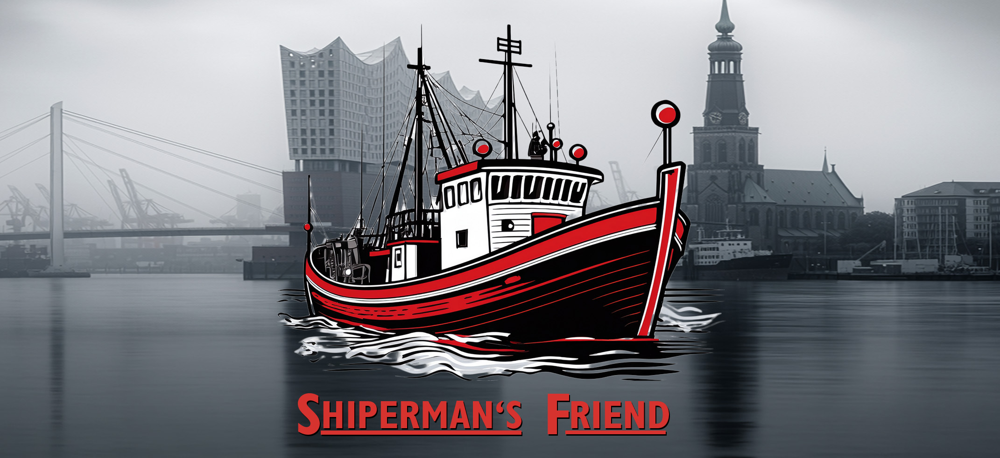
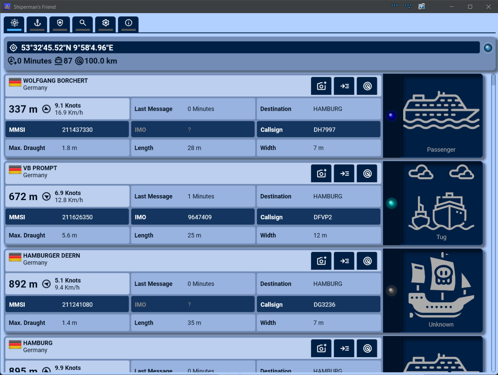
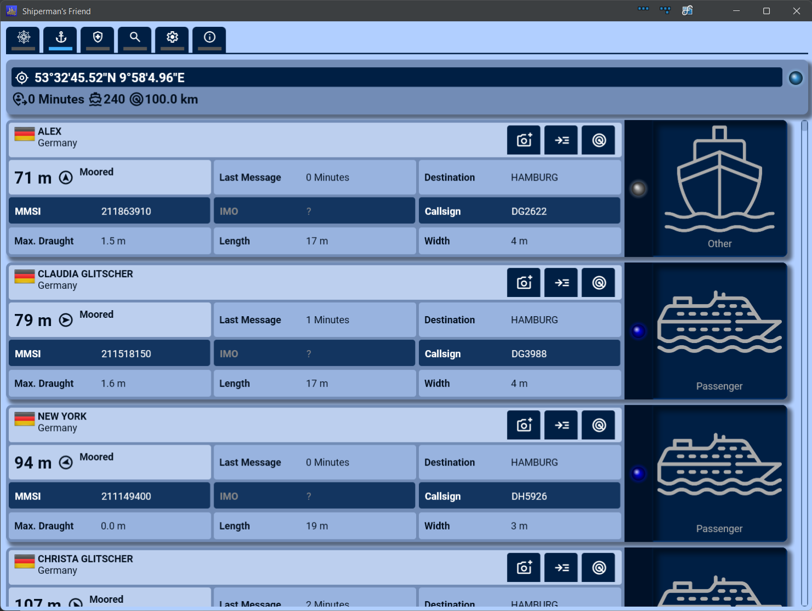
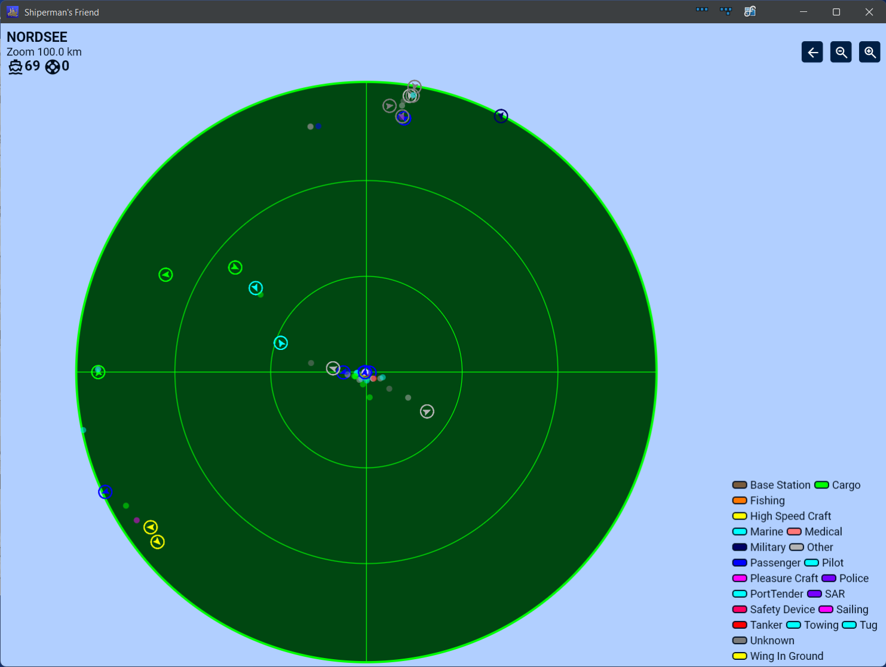
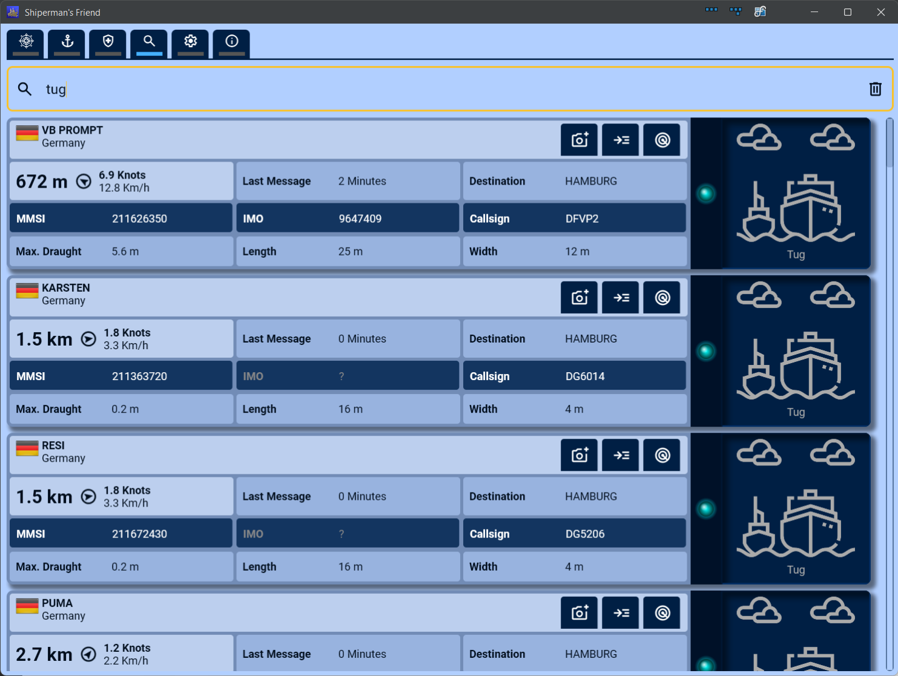
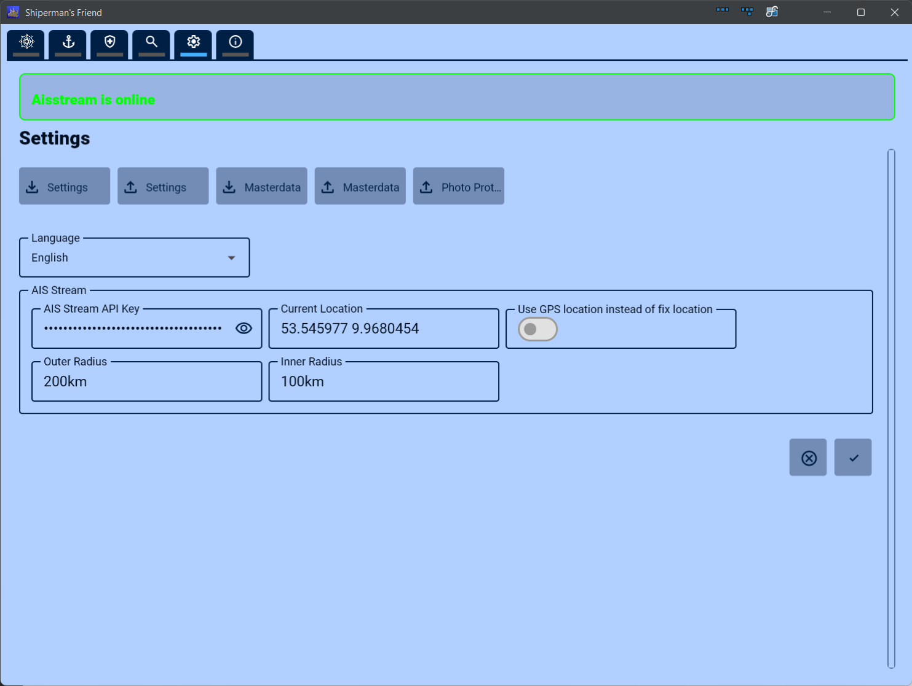

= shipermansfriend
:doctype: book
:description: Documentation for shipermansfriend
:keywords: kotlin multiplatform, AIS
:icons: font
:toc:
:toc-title: Contents
:toclevels: 10

ifndef::backend-pdf[]
== Status

image:https://github.com/sknull/shipermansfriend/actions/workflows/publish.yml/badge.svg[Shiperman's Friend CI,link=https://github.com/sknull/shipermansfriend/actions/workflows/publish.yml]
image:https://img.shields.io/badge/version-1.0.0 SNAPSHOT-ffaa00.svg?style=flat[badge-version]

== Supported Platforms

image:https://img.shields.io/badge/platform-android-3DDC84.svg?style=flat[badge-android]
image:https://img.shields.io/badge/platform-windows-0078D7.svg?style=flat[badge-windows]
image:https://img.shields.io/badge/platform-linux-654FF0.svg?style=flat[badge-linux]
endif::[]
ifdef::backend-pdf[]
== Status

Version 1.0.0-SNAPSHOT

== Supported Platforms

- Android
- Windows
- Linux
endif::[]

== About

Shiperman's Friend is a simple to use yet powerful ship spotter centric vessel tracker app.
It has no fancy map view or vessel history - there are plenty of apps covering that kind of features. Instead, it focuses on the needs of a ship spotter in the field observing and photographing all the vessels out there.

== Thanks

First things first.
Many thanks go out to the volunteer team at iostream.io. Without your work to keep this up and running this project would not be possible or even exist!

=== Features

- Using aisstream.io as it's only data source as this the only service providing AIS livedata for free. It is mandatory to create a free account and obtain an api key (also free).
- Configurable double geo fence. Ship master data and safety messages are collected within the outer bounding box whereas position data is only collected within the inner bounding box. This inner bounding box is treated as the monitoring range of the ship spotter.
- Card view of all moving and moored vessels (separate tabs) in the monitored bounding box which shows the most important infos for a vessel.
- Vessel radar view to orientate in a dense environment.
- Search tab to find and spot vessels of your interest.
- Safety message tab which display all safety relevant messages which have been sent in the outer bounding box.
- Mark/unmark any vessel as photographed (or just for interest). Within the settings tab you can then export the list of all marked vessels as csv file. For this list the time of hitting the mark button is used to have the vessel in order of observation for the later post-processing session at home.
- Export and import of collected ship masterdata so you can collect data overnight on your desktop and use this data on your mobile device.
- Export and import of settings. The API key is treated as a password and is stored encrypted with a platform key.
- To avoid any costs as most ship spotters are hobbyists no commercial data source is used to obtain extra infos like TEUs, etc. Unfortunately there is no free data source for this out there.
I also do not want to scrape data out of websites as this would end in a legal mess. Instead, every vessel card has a button which sends you to the vessel page of https://www.myshiptracking.com/[myshiptracking]. As the search parameter the mmsi or imo code is used (if available). I think this is a good compromise and will lead to some extra traffic for that provider.

== Screenshots

=== Driving Vessels Tab

The tab shows all vessels currently under way within the inner bounding box.

The top bar shows the coordinates of you current location. When you click on it you are being sent to googlemaps to the show the location on a map.
Below y<ou can see the amount of minutes ago of the last location update, the number of vessels in the view and the currently chosen inner radius.
The led on the right shows if messages from aisstream.io are received (light blue) or not (dark/off). When no messages are received for a longer time interval starting with 30 seconds the color will slowly go from orange to pink which tells you that the server is currently offline. In that state a button is shown which allows you to manually try to reconnect.

Under that the vessel cards are shown which contain only the ionformation which can be obtained from aisstream.io. I decided not to scrape other webpages for additional interesting information like tonnage, TEUs etc. Instead, you can click on the middel button on the right to open a browser with the vessels page on https://www.myshiptracking.com/. I have chosen this provider as it is the only one which allows to search for mmsi numbers which is mandatory for this project as aisstream only sporadically provides imo numbers for vessels.
When you click on the rightmost icon with the radar icon the radar page is opened with the selected vessel being highlighted with a white flashing circle.
The right big blue section shows an icon for the ships category and a led light with the official category colors used by most of the AIS data provers out there.

=== Moored Vessels Tab

The tab shows all vessels with a sog (speed over ground) less than 0.5 knots.
Those are considered as moored.
The overall layout is the same as for the driving vessels tab.

=== Radar Page

The radar page shows you all vessels within the inner radius to allow you to orientate in a dense spotting environment such as a harbor. The currently selected vessel (that one where you clicked on the radar button) is highlighted with a white flashing circle. vessels having current safety messages are highlighted with a red flashing circle. Driving vessels are depicted with an arrow showing the current heading and moored vessels are displayed as a small circle by default (when the vessel is big enough its size as reported by AIS data is shown using a rectangle) You can hover over vessel icons to show all vessel data in short form under the cursor or thumb.
The bar on the top shows the name of the currently selected vessel and below that the number of vessels within the perimeter, additionally thoise vessels having a safety message.
On the top right you find buttons to zoom in and out and to jump back to the previous view.
The bottom (right) shows a legend with all know vessel categories.

=== Search Vessels Tab

This tab allows you to search for vessel names, mmsi, imo, callsign, or ship category (english category names only).
The overall layout is the same as for the driving vessels tab.

=== Settings Tab

The basic settings tab where you can set the outer and inner radius around the current location (when use gps location is switched on), or the entered coordinates as a fallback.
The coordinates can be entered either as double values or in DMS notation. The radius can be entered either as double (not dot or fraction needed) or with either m (meters) or km (kilometers) unit.
You can switch on and off "use gps location" during your session. The location will then be updated and used as the new centerpoint for your outer and inner bounding boxes.
To obtain an API key for aisstream.io (which is currently the one and only free of charge open data source for AIS data) you have to register on their https://aisstream.io/[website] and create an API key.

== Legal

=== License

link:LICENSE[GNU GENERAL PUBLIC LICENSE v3 (2007)]

This project is licensed under GPLv3. If you use this code in your app, your entire app must also be open-sourced under GPLv3.

==== What this means for you

You are free to use, modify, and distribute this software.

===== Copyleft

If you use this code in your own project or app, your entire project must also be licensed under GPLv3 and its source code must be made public. This effectively prevents using this code in "closed-source" commercial apps. If you intend to sell an app based on this code without releasing your source code, you are in violation of this license.
Of course, you can always for a commercial license.

=== Attribution

Vessel Icons are taken from https://www.flaticon.com[Freepik - Flaticon]

=== Note

The banner was created by myself using Adobes Firefly AI engine which quarantees commercial compatibility. I did not use any original artwork of the well known suits company and researched that the Font used for the brand is indeed just Gill Sans which is available for free download in the internet. So no harm done here.
